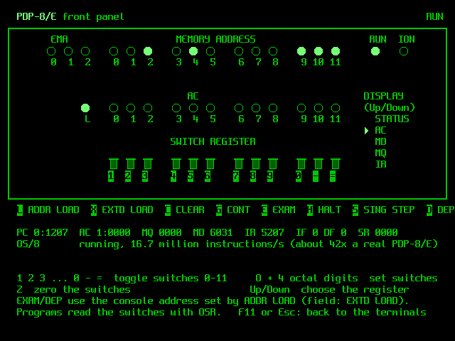

# PDP-8/E emulator for the Adafruit Fruit Jam

This turns an [Adafruit Fruit Jam](https://www.adafruit.com/product/6200) (RP2350B) into a
PDP-8/E minicomputer. It runs **OS/8** from an RK05 cartridge-disk image on the microSD card, or
the **TSS/8** time-sharing system with up to five users logged in at once. TSS/8 comes in two
versions: DEC's TSS/8.24, and **UWM TSS/8.25** from the University of Wisconsin–Milwaukee, which
is assembled from source (see [`uwm/`](uwm/README.md)).
Output goes to an HDMI/DVI monitor as an 80×30 green-screen terminal. You type on a USB keyboard,
or connect from a computer over the USB-C serial ports.

```
Adafruit Fruit Jam PDP-8/E - OS/8 V3D - KBM V3Q - CCL V1F
Configured on 2026.09.24 at 17:53:24 PDT

Restart address = 07600

Type:
    .DIR                -  to get a list of files on DSK:
    .DIR SYS:           -  to get a list of files on SYS:
    .R PROGNAME         -  to run a system program
    .HELP FILENAME      -  to type a help file

.
```

## What is emulated

| Unit | Notes |
|---|---|
| PDP-8/E CPU, 32K words | Full instruction set, interrupts, KM8E memory extension (including user-mode traps) |
| KE8E EAE | Mode A and mode B (MUY, DVI, NMI, shifts, DAD, DST, DPIC, DCM, SAM, …) |
| KL8E console (03/04) | Keyboard and screen. The KSR mark bit is set on input. |
| RK8E + 4 × RK05 (74) | Disk images live on the microSD card. Uses the SIMH `.rk05` format, so PiDP-8/I and SIMH images work unchanged. |
| DK8-E line clock (13) | 60 Hz |
| LE8 line printer (66) | Output is appended to `printer.txt` on the SD card. |
| PC8E paper tape (01/02) | Reader input comes from `reader.bin` on the card; punch output is appended to `punch.bin`. |
| KL8E ×4 multiplexer (40–47) | TSS/8 terminals K01–K04. Each has its own virtual screen and USB serial port. |
| RF08 + RS08 (60–62, 64) | TSS/8 system disk (`tss8_rf.dsk`, 256K words). Blocks are cached in RAM and written back to the card. |

The CPU is an independent C rewrite that follows SIMH's PDP-8 behaviour. It was checked against
SIMH with the same OS/8 and TSS/8 sessions and produced identical output (see [Testing](#testing)).

## What you need

* An Adafruit Fruit Jam
* A monitor or TV with HDMI input, and an HDMI cable
* A USB keyboard for one of the Fruit Jam's USB-A ports, or a computer running a terminal program
  on the USB-C port
* A microSD card formatted FAT32 or exFAT

## Quick start

1. **Flash the firmware.** Hold **Button 1** (BOOT) and tap **RESET**. A drive called `RP2350` appears.
   Copy `pdp8_fruitjam.uf2` onto it.
2. **Prepare the SD card.** Copy everything in the `sdcard/` folder to the root of the card:
   * `os8.rk05`: OS/8 V3D with BASIC, FORTRAN II/IV, PAL8, MACREL, TECO, U/W FOCAL, Adventure,
     BASIC games, Kermit-12 and more
   * `ock.rk05`: the OS/8 "Combined Kit" (V3D/V3F)
   * `blank.rk05`: an empty cartridge for your own files
   * `tss8_init.bin` and `tss8_rf.dsk`: DEC TSS/8.24 (the INIT loader tape and the RF08 system disk)
   * `uwm_init.bin` and `uwm_rf.dsk`: UWM TSS/8.25
   * `pdp8.cfg`: settings (optional)
3. Insert the card, connect the monitor and keyboard, and power up. During the 3-second countdown,
   press **O** for OS/8, **T** for DEC TSS/8 or **U** for UWM TSS/8. If you don't press anything, it boots the `system=`
   setting in `pdp8.cfg` (OS/8 out of the box). OS/8 comes up at the `.` prompt.

Updating from an earlier version: flash the new `.uf2`, and copy any `tss8_*`/`uwm_*` files you
don't have yet, plus the new `pdp8.cfg`, to the card. Your existing disk images keep working.

## Using it

| Key | Action |
|---|---|
| **F12** or **Button 1** | System menu: continue, boot OS/8 / TSS/8 / UWM TSS/8, restart the OS/8 monitor at 07600, swap disk images, default system, keyboard case (K), speed, colour, save settings |
| **Alt-F1 … Alt-F5** | TSS/8: switch the monitor between the console (K00) and terminals K01–K04 |
| **F11** (or Alt-F6) | PDP-8/E front panel (lamps, switch register, console keys); F11 or Esc returns |
| Caps Lock | Toggles forced upper case (on by default, as on a Teletype; OS/8 commands must be upper case) |
| Backspace / Delete | RUBOUT (0177), which is OS/8's delete |
| Ctrl-C | Returns to the OS/8 monitor |
| Ctrl-O / Ctrl-U | Suppress output / delete the line |
| Arrow keys | VT52 cursor keys (ESC A/B/C/D) for TECO VTEDIT, KED, etc. |
| F1–F4 | VT52 PF1–PF4 |

**Serial ports:** the USB-C port shows up on your computer as **five** USB serial devices (for
example `/dev/ttyACM0`–`4`, `/dev/cu.usbmodem…`, or `COM` ports), named "PDP-8 Console K00" and
"TSS/8 Line K01"–"K04". Connect with any terminal program; the baud rate doesn't matter.
* The first port is the console. Everything on the console screen is copied to it, typing there
  works the same as on the keyboard, and **Ctrl-\\** opens the system menu.
* The other four are TSS/8 terminals K01–K04. They are only used while TSS/8 is running. Each one
  mirrors its virtual screen (Alt-F2 … Alt-F5), so several people can use TSS/8 from their own computers
  while someone else types on the Fruit Jam's keyboard.

**Screen:** the display is a VT52 with a few VT100 (ANSI) sequences added, so full-screen OS/8
editors work.

### A few things to try

```
.DIR                         list files on the system disk
.R BASIC                     BASIC  (NEW, give a name, type a program, RUN, BYE)
.EXECUTE HELLO.FT            compile and run a FORTRAN IV program (create it with EDIT or PIP)
.PAL PROG/L                  assemble PROG.PA with PAL8; .LOAD PROG / .START
.R UWF16K                    U/W FOCAL
.R FRTS  then  *ADVENT.LD<Esc>   Colossal Cave Adventure (press Enter at the three file prompts)
.R CHEKMO                    chess
.ZERO RKA1:                  initialise the first half of the disk in drive RK1 (blank.rk05)
.ZERO RKB1:                  ...and the second half
.COPY RKA1:<*.BA             copy files onto it
```

On OS/8 each RK05 cartridge appears as two devices: RKAn and RKBn for drive *n*.

### TSS/8

TSS/8 is DEC's time-sharing system for the PDP-8. It runs several users at once, each with their own
BASIC, FOCAL, FORTRAN, editor and files. To start it:

1. Press **T** at the boot countdown, or choose **T** in the F12 menu.
2. The console asks `LOAD, DUMP, START, ETC?`. Type `START`.
3. Enter the date as `M-D-YY` and the time as `HH:MM`, for example `9-25-84` and `09:35`. TSS/8.24
   only accepts years from 1974 to 1984, so pick a year in that range.
4. On any terminal, press Enter and then log in with `LOGIN 2 LXHE` (account 2, password LXHE).

```
.LOGIN 2 LXHE
TSS/8.24  JOB 01  [00,02]  K01    09:35:04
.SYSTAT                     who is logged in, free core and disk
.R CAT                      list your files
.R BASIC                    BASIC  (NEW / OLD, RUN, SAVE, BYE)
.R FOCAL                    FOCAL  (answer YES to keep LOG/EXP/ATN)
.R EDIT, .R FORT, .R PALD   editor, FORTRAN, PAL-D assembler
^B S                        stop the running program (Ctrl-B, then S)
.LOGOUT
```

**UWM TSS/8** is started the same way (press **U**). Two differences: it only lets you log in
with a **Ctrl-B** in front of `LOGIN`, and it prints a message of the day. See
[`uwm/README.md`](uwm/README.md) for how it was built and what was changed.

Switch between the console and K01–K04 with **Alt-F1 … Alt-F5**, or use the extra USB serial ports.
Five people can be logged in at once. The RF08 disk is cached in RAM and written back to
`tss8_rf.dsk` about once a second, so let it settle (LED off) before you power off. Keep a copy of the
original `tss8_rf.dsk` if you want to be able to start over.

### Front panel

Press **F11** for a PDP-8/E-style front panel. The machine keeps running while you watch it.



* **Lamps:** EMA + MEMORY ADDRESS (15 lamps), a 12-bit register display, and RUN and ION. The
  **Up/Down** keys turn the selector to STATUS, AC (with the link lamp), MD, MQ or IR. While the
  panel is on screen, the CPU samples its registers every few dozen instructions. Each lamp's
  brightness follows how often it was lit, and fades a little like an incandescent bulb, so the
  familiar idle-loop and swapping patterns show up.
* **Switch register:** the number-row keys **1 2 3 … 9 0 - =** flip switches 0–11. **O** followed by
  four octal digits sets them all at once, and **Z** clears them. Programs read the switches with
  `OSR`.
* **Console keys:** **H** HALT, **G** CONT, **S** SING STEP, **L** ADDR LOAD (PC and console address
  ← switches), **X** EXTD ADDR LOAD (IF ← switches 6–8, DF ← 9–11), **E** EXAM, **D** DEP (store the
  switches and advance) and **C** CLEAR. Like the real console, EXAM/DEP/ADDR LOAD/CLEAR/SING STEP
  only work while the machine is halted.

Toggling in a program the 1970s way looks like this. Press H, then O0200 and L to set the address.
Then, for each word, O and four octal digits followed by D to deposit it. Finally O0200, L and G to
run it.

### Settings (`pdp8.cfg`)

```
system=os8          # what to boot at power-up: os8, tss8 or uwm
rk0=os8.rk05        # disk images for drives 0-3 (files in the root of the card)
rk1=blank.rk05
rk2=ock.rk05
rk3=
tss8_bin=tss8_init.bin   # TSS/8 INIT tape (BIN format)
tss8_rf=tss8_rf.dsk      # TSS/8 RF08 disk image (SIMH format)
uwm_bin=uwm_init.bin     # UWM TSS/8.25 INIT tape
uwm_rf=uwm_rf.dsk        # UWM TSS/8.25 RF08 disk image
color=green         # green, amber, white, blue
uppercase=on        # fold keyboard input to upper case
speed=full          # full = as fast as the RP2350 can go; real = ~400K instr/s like an 8/E
autoboot=3          # seconds before booting; -1 waits for Enter
```

You can change all of these from the F12 menu, and **W** in that menu writes them back to the card.
If `os8.rk05` is missing, the first `*.rk05` file on the card is booted. An image shorter than a
full RK05 (for example one produced by SIMH) is padded with zeros to 3,325,952 bytes the first time
it is mounted.

Writes go straight to the image file on the card, and the file is synced after half a second without
disk activity. The on-board LED (GPIO29) lights while there are unsynced writes. Wait for it to go out before you
switch off.

## How it works

```
core 0: PDP-8/E CPU + devices ─ RK8E / RF08 ─► FatFs ─► SPI microSD (GPIO34-36, CS 39)
        TinyUSB host (PIO-USB, GPIO1/2, via the on-board hub) ─► keyboard
        TinyUSB device (native USB-C) ─► 5 CDC serial ports (K00-K04)
        5 virtual terminals (VT52/ANSI), one per PDP-8 terminal line
core 1: HSTX DVI 640x480@60 (GPIO12-19), scanlines rendered on the fly
        from the selected terminal's 80x30 character buffer with an 8x16 font
```

The clocks follow the approach of the Adafruit/Pimoroni DVHSTX driver. The system runs at 240 MHz
from the USB PLL, an exact multiple of 12 MHz, which PIO-USB needs. The system PLL is free to make the
exact 126 MHz HSTX clock (25.2 MHz pixels). The whole program runs from RAM (`copy_to_ram`).

```
core/        portable PDP-8/E emulator (pdp8.c/.h); no hardware dependencies
firmware/    Fruit Jam firmware (Pico SDK): main, video, terminal, front panel, keyboard, SD card, USB
host/        Linux/macOS command-line build of the same core, used for testing
lib/         Pico-PIO-USB (MIT)
sdcard/      disk images + sample config for the microSD card
tests/       comparison tests against SIMH, and the UWM TSS/8 functional test
tools/       font converter, OS/8 image build script, palbart PDP-8 assembler
uwm/         UWM TSS/8.25 sources, patches and the script that builds uwm_rf.dsk
```

## Building from source

Firmware (needs Pico SDK 2.2 or newer, which has the `adafruit_fruit_jam` board, plus
`arm-none-eabi-gcc`):

```sh
git clone https://github.com/raspberrypi/pico-sdk
git -C pico-sdk submodule update --init lib/tinyusb
export PICO_SDK_PATH=$PWD/pico-sdk
make firmware            # -> pdp8_fruitjam.uf2
```

Desktop build of the emulator, for trying OS/8 or TSS/8 in a terminal (Ctrl-E quits):

```sh
make host
cp sdcard/os8.rk05 /tmp/ && build/pdp8host /tmp/os8.rk05
cp sdcard/tss8_rf.dsk /tmp/ && build/pdp8host -tss8 /tmp/tss8_rf.dsk sdcard/tss8_init.bin 4000
#   ...then connect extra TSS/8 terminals with:  nc localhost 4000   (or telnet)
```

Rebuild the OS/8 disk images from the original DEC distribution DECtapes (this uses the PiDP-8/I
project's tools and SIMH): `tools/build-images.sh`. Rebuild UWM TSS/8 from its sources:
`make uwm`.

## Testing

`make test` runs the same scripted OS/8 and TSS/8 sessions on SIMH and on this core and compares the
transcripts. It needs a SIMH `pdp8` binary in `SIMH_PDP8` and Python `pexpect`. The sessions
cover:

* `DIR`, PIP file creation, CCL commands
* FORTRAN IV compile, load and run (`EXECUTE`), including trig, exp/log and integer loops
* PAL8 assembly, `LOAD` and `START` of the resulting program
* BASIC with floating-point functions and arrays, plus `SAVE`
* U/W FOCAL (interrupt-driven terminal I/O)
* `tests/eaetest.pa`: an EAE exerciser that checksums 512 random operand pairs through every
  mode A and mode B instruction
* TSS/8 (`tests/tss8test.py`): INIT start-up, date and time, login, `R CAT`, a BASIC prime sieve,
  FOCAL, `SYSTAT` and `LOGOUT` on the console. This exercises the RF08 disk, user-mode traps,
  swapping and the clock.

* UWM TSS/8.25 (`tests/uwmtest.py`). SIMH can't run this monitor unmodified (see
  [`uwm/README.md`](uwm/README.md)), so this is a functional test. It covers start-up, Ctrl-B login on
  the console and all four lines, the message of the day, BASIC on four lines at once, SYSTAT showing
  all five jobs, CAT, FOCAL and LOGOUT.

Except for the UWM test, all of these give identical output on SIMH and on this core. On the desktop build, all five TSS/8 terminals
(the console plus four multiplexer lines) were also logged in at once, with four of them running BASIC
programs at the same time.
Adventure, CHEKMO, a second RK05 drive
(`ZERO`/`COPY`/`DIR RKA1:`) and the OS/8 Combined Kit image were also run on the desktop build.

**Hardware status:** v1.0 (OS/8), v1.1 (DEC TSS/8, virtual terminals, extra USB serial ports) and
v1.2 (UWM TSS/8, paper tape) have been run on a real Fruit Jam. v1.3 adds the front panel. The
panel's drawing and console keys were checked on the desktop build, which produced the screenshot
above. It compiles cleanly for the RP2350 (about 117 KB of code and 162 KB of RAM) but has not yet
been run on the board.

## Licences

* Emulator, firmware and tools: MIT. The CPU and device semantics follow SIMH (Robert M Supnik,
  MIT-style licence).
* HSTX DVI code: derived from pico-examples (BSD-3-Clause).
* Pico-PIO-USB: MIT. FatFs: ChaN's FatFs licence (see `firmware/fatfs/LICENSE.txt`).
* Font: Spleen 8x16 by Frederic Cambus, BSD-2-Clause (`firmware/FONT-LICENSE-spleen.txt`).
* OS/8 and its utilities are DEC software, distributed under the DEC hobbyist licence in
  `sdcard/OS8-LICENSE.md` (non-commercial use). The disk images were built with the
  [PiDP-8/I](https://tangentsoft.com/pidp8i) project's tools.
* UWM TSS/8.25 sources: DEC TSS/8 as extended at the University of Wisconsin–Milwaukee
  (Richard Bartlein, 1974–76), from bitsavers and Brad Parker's cpus-pdp8 project. `uwm_rf.dsk`
  carries the DEC TSS/8.24 library file system. palbart (`tools/palbart`) is free software; its
  licence is included with it.
* The TSS/8.24 files (`tss8_init.bin`, `tss8_rf.dsk`) are the SIMH TSS/8 kit as redistributed by
  the PiDP-8/I project. That project describes their licensing as not fully settled but believed
  freely redistributable for hobby use (see its `COPYING.md`).
